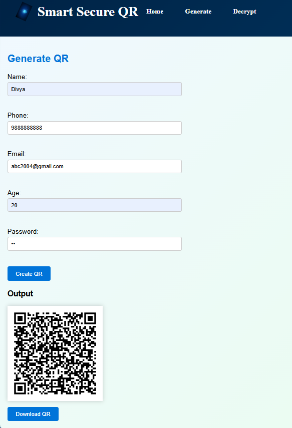
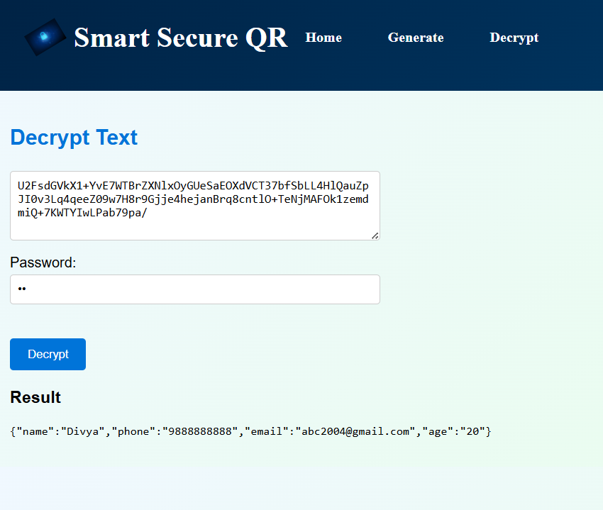
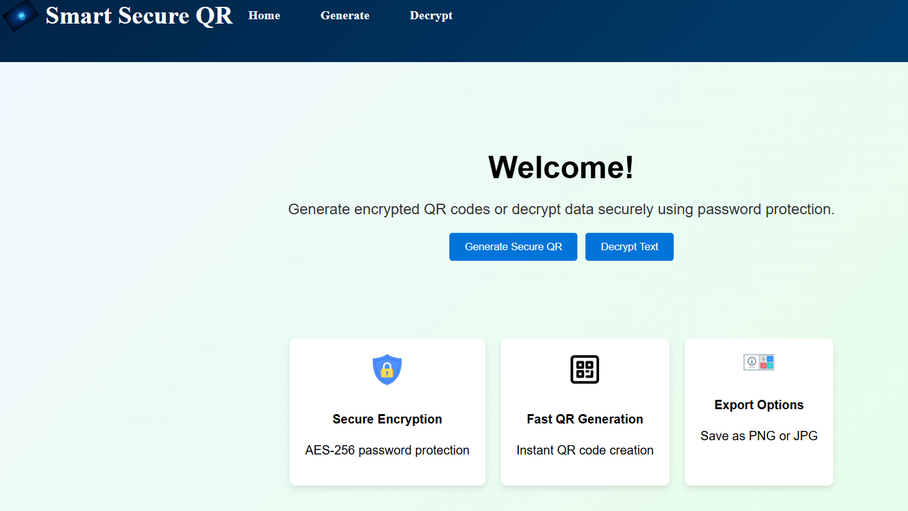

# Smart Secure QR Generator

🔗 **Live Demo:** https://smart-secure-qr.netlify.app/

Smart Secure QR Generator is a project that allows users to create **encrypted QR codes** containing personal data such as name, phone, email, and age. The information is encrypted with a password before generating the QR code and can only be decrypted using the same password.

This repository contains **two complementary applications**:

1. **Desktop Application (C + Win32/GDI+)** – A Windows GUI application for generating and saving encrypted QR codes locally.
2. **Web Application (React)** – A browser-based interface that performs QR generation and decryption securely on the client side.

---

# Features

- Password-protected QR codes
- AES encryption of user data
- QR code generation directly in the browser
- Downloadable QR images
- Password-based decryption of QR data
- React single-page application
- Desktop GUI version for offline use

---

# Live Demo

Try the web version here:

https://smart-secure-qr.netlify.app/

---
## Screenshots

### Generate QR

### Decrypt QR

### Home Page

# Tech Stack

## Desktop Application

- C
- Win32 API
- GDI+
- QR encoding library
- AES encryption integration

## Web Application

- React
- CryptoJS (AES encryption)
- QRCode library
- React Router
- Netlify (deployment)

---

# Repository Structure
Smart Secure QR Generator
│
├── README.md
├── Makefile
├── .gitignore
│
├── src/ # Desktop application
│ ├── main.c
│ ├── aes.c / aes.h
│ ├── qr.c / qr.h
│ ├── history.c / history.h
│
├── web/
│ └── frontend/ # React application
│ ├── package.json
│ ├── public/
│ ├── src/
│ │ ├── App.js
│ │ ├── Generate.js
│ │ ├── Decrypt.js
│ │ └── Home.js
│ └── build/

---

# Running the Web App Locally
cd web/frontend
npm install
npm start

The application will start at:

http://localhost:3000

---

# Building the Production Version
cd web/frontend
npm run build

This generates the `build/` folder which can be deployed to hosting platforms like Netlify.

---

# Deployment (Netlify)

1. Push the repository to GitHub.
2. Go to **Netlify → New site from Git**.
3. Select the repository.
4. Configure build settings:

Build command
npm run build

Publish directory
web/frontend/build

5. Deploy the site.

---

# Security Model

User data is encrypted before generating the QR code.

Encryption flow:
User Input
↓
AES Encryption (CryptoJS)
↓
Encrypted Text
↓
QR Code Generation

Decryption requires the **same password** used during encryption.

---

# Future Improvements

- QR code scanner using camera
- Mobile friendly UI
- Save QR history
- Desktop encryption integration
- Cross-platform mobile version

---

# Author

Divya Gupta